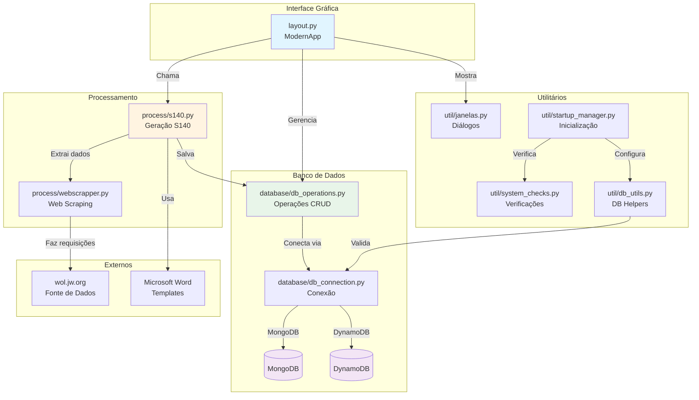
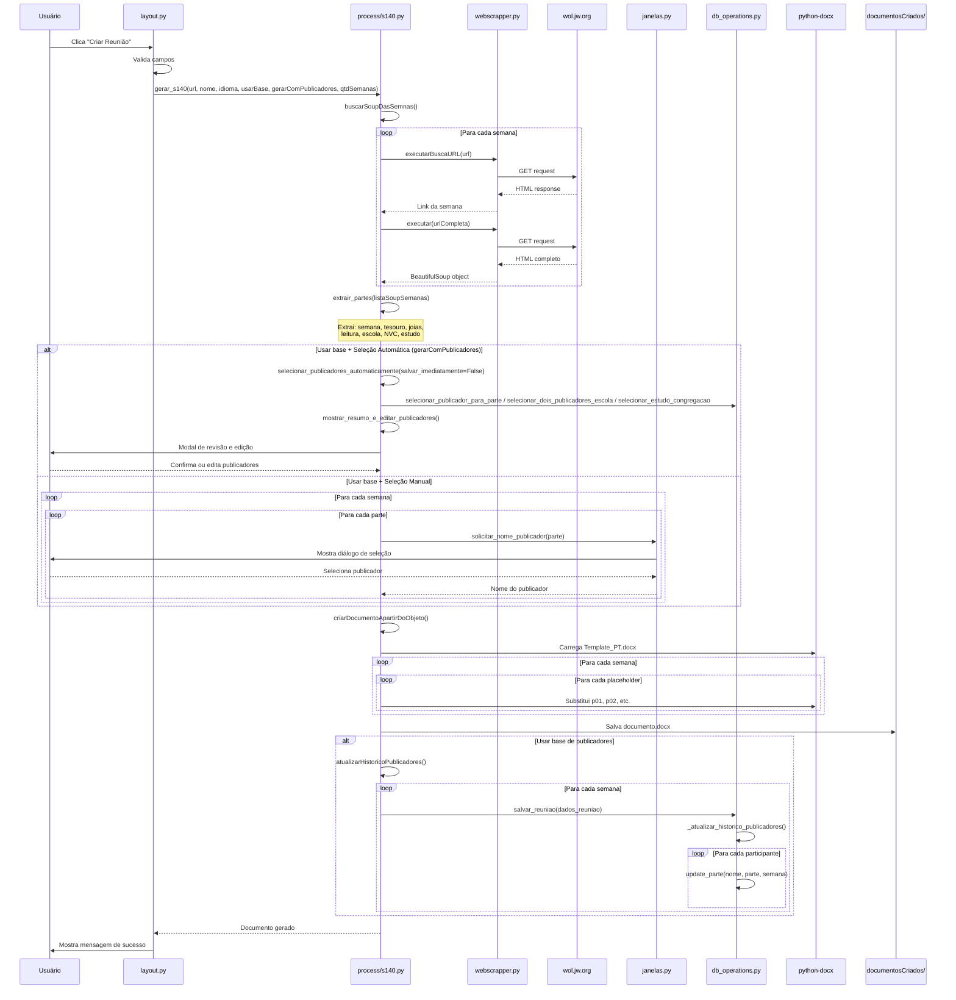
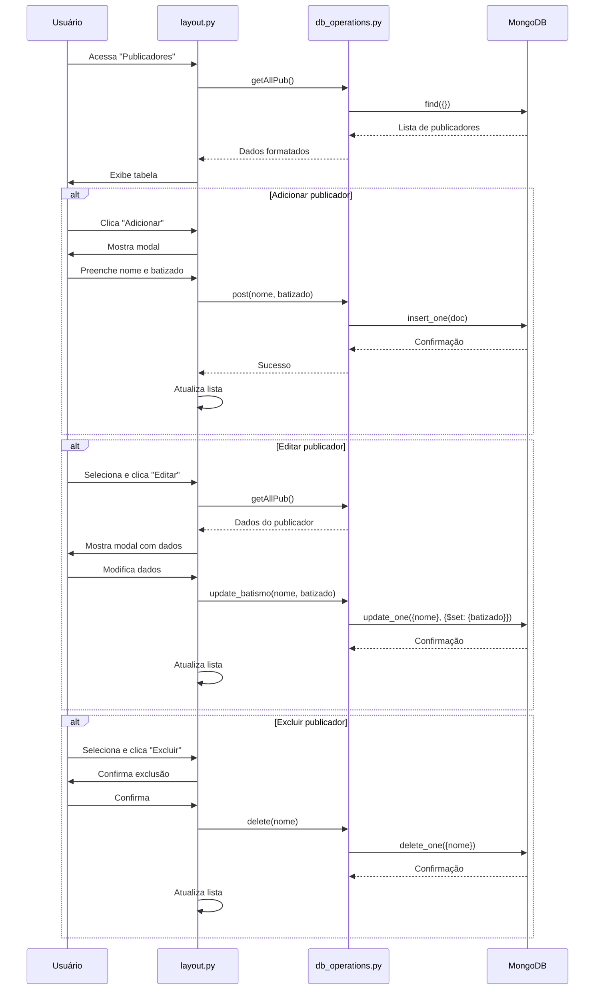
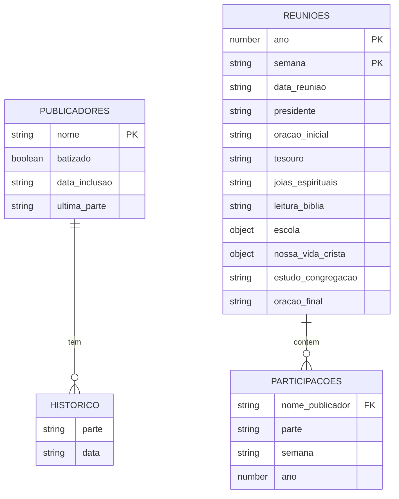
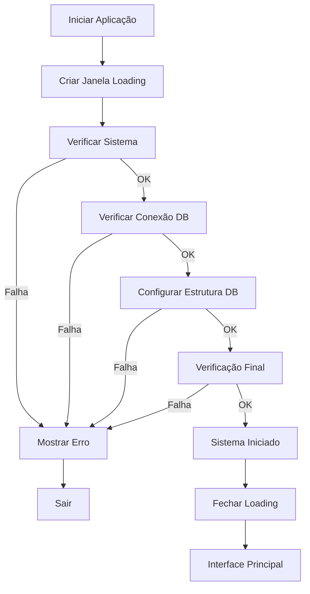

# JW Mural - Especificação Técnica para IA

Este documento fornece especificações técnicas detalhadas do sistema JW Mural para uso por assistentes de IA.

## 📐 Arquitetura do Sistema



## 🔄 Fluxo de Dados Principal

### Fluxo de Criação de Reunião



### Fluxo de Gerenciamento de Publicadores



## 🗄️ Estrutura de Banco de Dados

### Modelo de Dados - Publicadores

```javascript
{
  "nome": "String (único, obrigatório)",
  "batizado": "Boolean (obrigatório)",
  "sexo": "String - 'Masculino' ou 'Feminino' (padrão: 'Masculino')",
  "Anciao": "Boolean (padrão: false)",
  "Servo_Ministerial": "Boolean (padrão: false)",
  "permissoes": {
    "parte_escola": "Boolean - pode fazer partes da escola",
    "oracao": "Boolean - pode fazer orações",
    "leitura_livro": "Boolean - pode ler na reunião"
  },
  "data_inclusao": "String ISO (obrigatório)",
  "ultima_parte": "String (opcional)",
  "historico": [
    {
      "parte": "String (nome da parte)",
      "data": "String (formato: 'Semana X de YYYY')"
    }
  ]
}
```

**Índices MongoDB:**
- `nome`: único (unique index)

### Modelo de Dados - Reuniões

```javascript
{
  "ano": "Number (obrigatório)",
  "semana": "String (obrigatório, formato: 'S140' ou similar)",
  "data_reuniao": "String ISO (obrigatório)",
  "presidente": "String",
  "oracao_inicial": "String",
  "tesouro": "String",
  "joias_espirituais": "String",
  "leitura_biblia": "String",
  "escola": {
    "primeira_parte": "String",
    "segunda_parte": "String",
    "terceira_parte": "String",
    "quarta_parte": "String"
  },
  "nossa_vida_crista": {
    "primeira_parte": "String",
    "segunda_parte": "String"
  },
  "estudo_congregacao": "String",
  "oracao_final": "String",
  "ultima_atualizacao": "String ISO"
}
```

**Índices MongoDB:**
- `(ano, semana)`: único composto (unique index)
- `presidente`, `oracao_inicial`, `tesouro`, etc.: índices simples para busca
- `data_reuniao`: índice para ordenação

### Diagrama de Relacionamentos



## 📦 Módulos e Responsabilidades

### `layout.py` - Interface Gráfica Principal

**Classe Principal:** `ModernApp`

**Responsabilidades:**
- Interface gráfica usando ttkbootstrap
- Navegação entre funcionalidades
- Gerenciamento de janelas e modais
- Integração com módulos de processamento

**Métodos Principais:**
- `__init__(root)`: Inicializa interface
- `criar_quadro_de_anuncio()`: Janela de criação de reunião
- `publicadores()`: Gerenciamento de publicadores
- `historico()`: Histórico de reuniões
- `historico_publicadores()`: Histórico individual
- `dashboards()`: Visualizações estatísticas

**Dependências:**
- `ttkbootstrap`: Interface gráfica
- `process.s140`: Geração de documentos
- `database.db_operations`: Operações de banco
- `util.janelas`: Diálogos modais

### `database/db_operations.py` - Operações de Banco

**Classe Principal:** `DatabaseOperations`

**Responsabilidades:**
- CRUD de publicadores
- CRUD de reuniões
- Atualização de histórico
- Queries complexas para dashboards

**Métodos Principais:**

```python
# Publicadores
post(nome, batizado, sexo, permissoes)  # Criar publicador (sexo, permissoes opcionais)
getAllPub()                             # Listar todos
delete(nome)                            # Excluir
update_parte(nome, parte, semana)       # Atualizar histórico
update_batismo(nome, batizado)          # Atualizar status

# Reuniões
salvar_reuniao(dados_reuniao)          # Salvar/atualizar reunião
buscar_reuniao(ano, semana)             # Buscar específica
listar_reunioes(ano, semana, limite)   # Listar com filtros

# Histórico
buscar_historico_publicador(nome)       # Histórico individual
contar_reunioes_por_publicador()        # Estatísticas
```

**Critérios por Parte (seleção automática):**

| Parte | Critério |
|-------|----------|
| Presidente | Apenas Ancião |
| Oração Inicial | Ancião OU Servo Ministerial OU permissão oração |
| Tesouro, Joias Espirituais | Ancião OU Servo Ministerial |
| Leitura da Bíblia | Masculino, permissão leitura, NÃO Ancião, NÃO SM |
| Escola (1ª, 2ª, 4ª parte) | Permissão parte_escola, NÃO Ancião, NÃO SM — 2 pessoas mesmo sexo |
| Escola (3ª parte - Discurso) | Masculino, permissão parte_escola, NÃO Ancião |
| Escola (3ª parte - Estudo) | 2 pessoas mesmo sexo |
| NVC (1ª e 2ª parte) | Apenas Ancião |
| Estudo de Congregação | Ancião ou ajudante com permissão leitura |

Ordenação: prioriza quem está há mais tempo sem fazer a parte (`calcular_tempo_sem_fazer`).

**Detalhes de Implementação:**
- Suporta MongoDB e DynamoDB via abstração
- Detecção automática de duplicações
- Normalização de nomes (TitleCase)
- Suporte a múltiplos publicadores por parte (separados por `/`)

### `database/db_connection.py` - Conexão com Banco

**Classe Principal:** `DatabaseConnection`

**Responsabilidades:**
- Gerenciar conexões MongoDB/DynamoDB
- Carregar configurações do `.env`
- Abstrair diferenças entre bancos

**Configuração:**
- Lê `DB_TYPE` do `.env`
- MongoDB: `MONGODB_URI`, `MONGODB_DB_NAME`, `MONGODB_COLLECTION`
- DynamoDB: `AWS_REGION`, `DYNAMODB_TABLE`

### `process/s140.py` - Geração de Documentos

**Classe Principal:** `s140`

**Métodos Principais:**

```python
gerar_s140(url, nome, idioma, preencherPubs, gerarComPublicadores, qntdSemanas)
  ├─ buscarSoupDasSemnas()                    # Busca HTML das semanas
  ├─ extrair_partes()                          # Extrai dados do HTML
  ├─ [Se automático] selecionar_publicadores_automaticamente(salvar_imediatamente=False)
  ├─ [Se automático] mostrar_resumo_e_editar_publicadores()  # Modal de revisão
  ├─ [Se manual] solicitarNomePublicadorPartes()
  ├─ criarDocumentoApartirDoObjeto()
  └─ [Se preencherPubs] atualizarHistoricoPublicadores()
```

**Seleção Automática (db_operations):**
- `selecionar_publicador_para_parte(parte, semana, ja_selecionados, selecionados_global)` — Uma pessoa por parte, critérios por tipo
- `selecionar_dois_publicadores_escola(parte, semana, ...)` — Duas pessoas mesmo sexo (partes da escola)
- `selecionar_estudo_congregacao(semana, ...)` — Ancião ou ajudante com permissão de leitura

**Estrutura de Dados Extraída:**

```python
{
  'semana': 'S140',
  'capituloVersiculo': 'Capítulo e versículo',
  'canticoInicial': 'Número do cântico',
  'tesouro': 'Texto do tesouro',
  'perguntaJoias': 'Pergunta das joias',
  'leituraSemana': 'Leitura da semana',
  'iniciandoConversa': 'Parte 4',
  'cultivandoInteresse': 'Parte 5',
  'estudoDiscurso': 'Parte 6',
  'escola4': 'Parte 7',
  'canticoMeio': 'Cântico do meio',
  'nvcP1': 'NVC Parte 1',
  'nvcP2': 'NVC Parte 2',
  'estudo': 'Estudo bíblico',
  'canticoFinal': 'Cântico final',
  'Participantes': {  # Se preencherPubs=True
    'Presidente': 'Nome',
    'OracaoInicial': 'Nome',
    # ... outras partes
  }
}
```

**Sistema de Placeholders no Template:**

O template Word usa placeholders no formato `p01`, `p02`, etc.:

- `p01`: Semana
- `p02`: Capítulo e versículo
- `p03`: Cântico inicial
- `p06`: Tesouro
- `p08`: Pergunta das joias
- `p12`: Leitura da semana
- `p13-p16`: Partes da escola
- `p18`: Cântico do meio
- `p19-p21`: Nossa Vida Cristã e Estudo
- `p23`: Cântico final
- `p34-p45`: Nomes dos publicadores (se habilitado)

### `process/webscrapper.py` - Web Scraping

**Classe Principal:** `webscrapper`

**Métodos:**

```python
executar(url)                    # Faz requisição e retorna BeautifulSoup
executarBuscaURL(url)            # Busca link da semana específica
```

**Estrutura HTML Esperada (wol.jw.org):**

- `#p1`: Semana (ex: "S140")
- `#p2`: Capítulo e versículo
- `#p3`: Cântico inicial (formato: "número|texto")
- `#p5`: Tesouro (formato: "1. texto")
- `h3` com texto "2. Joias espirituais": Próxima div contém pergunta
- `h3` com texto "3. Leitura da Bíblia": Próxima div contém leitura
- `h3.dc-icon--music`: Cânticos (índice 1 = meio, último = final)
- `h3` com texto "4.", "5.", "6.", "7.": Partes da escola
- `h3` após segundo cântico: Partes NVC e Estudo

### `util/janelas.py` - Diálogos e Modais

**Classe Principal:** `janelas`

**Métodos:**

```python
solicitar_nome_publicador(parte, nomes_publicadores, semana)
  # Diálogo modal para seleção de publicador
  # Suporta busca e seleção múltipla (separado por /)
  # Retorna: String com nome(s) do publicador(es)

verificarInclusaoPublicador(nome, parte, semana)
  # Diálogo de confirmação quando publicador não existe
  # Permite adicionar com status de batismo
  # Retorna: Boolean (True se adicionado)
```

**Características:**
- Modais bloqueantes (grab_set)
- Busca em tempo real
- Suporte a múltiplos publicadores (formato: "Nome1 / Nome2")
- Validação de entrada

### `util/startup_manager.py` - Inicialização

**Classe Principal:** `StartupManager`

**Responsabilidades:**
- Verificações de sistema na inicialização
- Janela de loading durante verificações
- Validação de conexão com banco
- Configuração automática de estrutura

**Fluxo de Inicialização:**



### `util/system_checks.py` - Verificações

**Classe Principal:** `SystemChecks`

**Métodos Estáticos:**

```python
check_directories()              # Verifica diretórios necessários
check_required_files()           # Verifica arquivos necessários
check_environment()              # Verifica variáveis de ambiente
check_system_requirements()      # Verifica requisitos do sistema
run_all_checks()                # Executa todas as verificações
```

**Diretórios Obrigatórios:**
- `assets/`
- `documentosCriados/`
- `Templates/`
- `util/`
- `process/`
- `database/`

**Arquivos Obrigatórios:**
- `Template.docx`
- `.env`

## 🔌 Integrações Externas

### Web Scraping - wol.jw.org

**URL Base:** `https://wol.jw.org`

**Fluxo:**
1. Recebe URL da semana inicial (ex: `.../202400140`)
2. Extrai número da semana da URL
3. Gera URLs para semanas subsequentes
4. Para cada URL:
   - Busca link da página completa
   - Faz requisição GET
   - Parseia HTML com BeautifulSoup
   - Extrai dados estruturados

**Tratamento de Erros:**
- Timeout de requisições
- Validação de status HTTP
- Fallback para dados não encontrados ("não possui")

### Geração de Documentos Word

**Biblioteca:** `python-docx`

**Processo:**
1. Carrega template de `Templates/Template_PT.docx`
2. Itera sobre parágrafos e runs
3. Substitui placeholders (`p01`, `p02`, etc.)
4. Salva em `documentosCriados/`
5. Abre automaticamente no sistema

**Limitações:**
- Substituição apenas em runs de texto
- Não preserva formatação complexa
- Requer template pré-formatado

### Conexão com Banco de Dados

#### MongoDB

**Biblioteca:** `pymongo`

**Configuração:**
```python
MongoClient(MONGODB_URI)
db = client[MONGODB_DB_NAME]
collection = db[MONGODB_COLLECTION]
```

**Operações:**
- `insert_one()`: Inserir
- `find_one()`: Buscar único
- `find()`: Buscar múltiplos
- `update_one()`: Atualizar
- `delete_one()`: Excluir

#### DynamoDB

**Biblioteca:** `boto3`

**Configuração:**
```python
dynamodb = boto3.resource('dynamodb', region_name=AWS_REGION)
table = dynamodb.Table(DYNAMODB_TABLE)
```

**Operações:**
- `put_item()`: Inserir/Atualizar
- `get_item()`: Buscar
- `scan()`: Listar todos
- `update_item()`: Atualizar
- `delete_item()`: Excluir

## 📋 Padrões e Convenções

### Nomenclatura

**Arquivos:**
- Snake_case para módulos Python
- PascalCase para classes
- camelCase para variáveis locais

**Banco de Dados:**
- Nomes em TitleCase (ex: "João Silva")
- Normalização via `util.comandosUteis.TitleCase()`

**Placeholders:**
- Formato: `p##` (ex: `p01`, `p34`)
- Numeração sequencial

### Estrutura de Código

**Organização:**
- Módulos por responsabilidade
- Classes principais por arquivo
- Funções auxiliares em `util/`

**Tratamento de Erros:**
- Try/except com logging
- Mensagens de erro amigáveis ao usuário
- Logs detalhados para debug

**Threading:**
- Operações longas em threads separadas
- UI atualizada via `after()` do Tkinter
- Loading indicators durante processamento

### Validações

**Entrada de Dados:**
- Validação de campos obrigatórios
- Sanitização de nomes
- Verificação de duplicações

**Banco de Dados:**
- Validação de schema (MongoDB)
- Verificação de existência antes de atualizar
- Tratamento de erros de conexão

## 🔍 Queries e Agregações Importantes

### Buscar Histórico de Publicador

```python
# MongoDB
query = {
    "$or": [
        {"presidente": nome},
        {"oracao_inicial": nome},
        # ... todas as partes
    ]
}
reunioes = collection.find(query).sort("data_reuniao", -1)
```

### Contar Participações por Mês

```python
# Processa todas as reuniões
# Agrupa por publicador e mês
# Conta participações únicas por reunião
participacoes[nome][mes] += 1
```

### Buscar Reunião por Semana/Ano

```python
# MongoDB
filtro = {
    "ano": ano,
    "semana": semana.upper()
}
reuniao = collection.find_one(filtro)
```

## 🎨 Interface Gráfica

### Framework: ttkbootstrap

**Tema:** `litera` (claro, moderno)

**Componentes Principais:**
- `ttk.Window`: Janela principal
- `ttk.Toplevel`: Janelas secundárias
- `ttk.Frame`: Containers
- `ttk.Label`: Textos
- `ttk.Entry`: Campos de entrada
- `ttk.Button`: Botões
- `ttk.Treeview`: Tabelas
- `ttk.Combobox`: Dropdowns
- `ttk.Progressbar`: Barras de progresso

**Padrões de Design:**
- Cards no menu principal
- Modais centralizados
- Cores alternadas em tabelas
- Loading indicators durante processamento
- Mensagens de erro/sucesso via Messagebox

## 🚨 Pontos de Atenção para IA

### Ao Modificar Código

1. **Manter compatibilidade com MongoDB e DynamoDB**
   - Sempre verificar `db_type`
   - Usar abstrações de `db_connection`

2. **Preservar estrutura de placeholders**
   - Template Word depende de `p01-p45`
   - Não alterar numeração sem atualizar template

3. **Manter formato de dados**
   - Estrutura de `partesPorSemana` é crítica
   - Histórico segue formato específico

4. **Threading em operações longas**
   - Web scraping e geração de documentos
   - Sempre usar threads para não travar UI

5. **Validação de entrada**
   - Sempre validar antes de salvar
   - Normalizar nomes com `TitleCase()`

### Ao Adicionar Features

1. **Novos campos em reuniões:**
   - Atualizar modelo em `salvar_reuniao()`
   - Adicionar em `_atualizar_historico_publicadores()`
   - Atualizar template Word se necessário

2. **Novas queries:**
   - Adicionar método em `DatabaseOperations`
   - Considerar índices MongoDB
   - Testar com dados reais

3. **Novos diálogos:**
   - Seguir padrão de `util/janelas.py`
   - Modais bloqueantes
   - Validação de entrada

### Debugging

**Logs:**
- Sistema usa `logging` padrão Python
- Nível INFO por padrão
- Logs em `logs/` (se configurado)

**Erros Comuns:**
- Conexão com banco: Verificar `.env` e serviço
- Template não encontrado: Verificar caminho
- Web scraping falha: Verificar URL e estrutura HTML
- Duplicações: Verificar lógica em `_atualizar_historico_publicadores()`

## Mudanças Recentes

- **Seleção automática de publicadores:** `gerarComPublicadores` ativa critérios por parte (Ancião, SM, permissões, sexo) e prioriza tempo sem fazer.
- **Modal de revisão:** `mostrar_resumo_e_editar_publicadores` permite editar publicadores antes de gerar o documento.
- **Campos de publicador:** `sexo`, `permissoes` (parte_escola, oracao, leitura_livro), `Anciao`, `Servo_Ministerial`.
- **Partes da escola com 2 publicadores:** `selecionar_dois_publicadores_escola` garante mesmo sexo.
- **Estudo de congregação:** `selecionar_estudo_congregacao` para Ancião ou ajudante com permissão.

---

**Versão:** 1.1  
**Última atualização:** 2026  
**Para uso por:** Assistentes de IA e desenvolvedores

